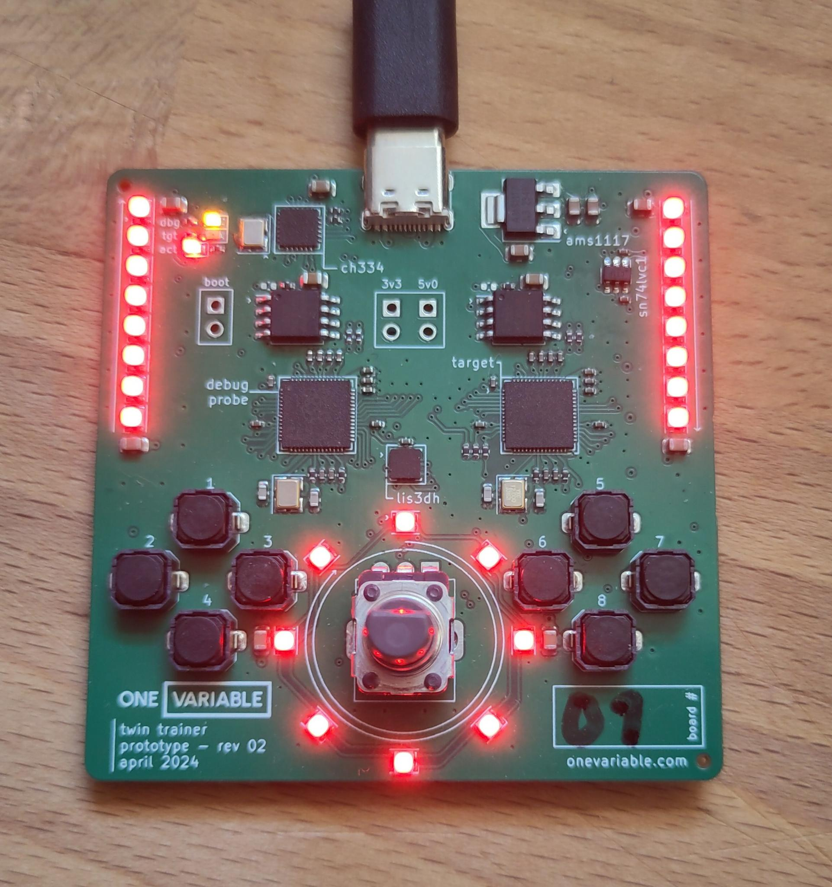
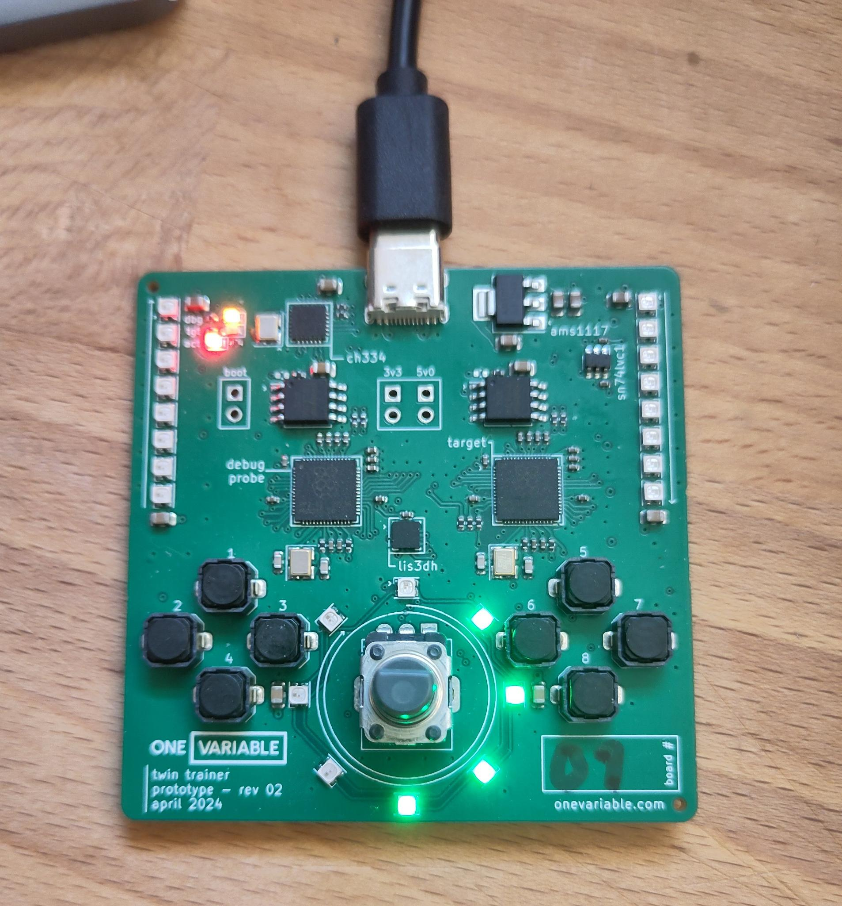

# SmartLEDs

## Flashing the project

Let's go ahead and run our first program on the board. You can plug in your board to your PC.

You should see the USB lights flash briefly, then the SmartLEDs should begin pulsing a red color.

It should look like this:



Now, from the same terminal you built from, we'll go ahead and run the binary:

```sh
$ cargo run --release --bin hello-01
    Finished release [optimized + debuginfo] target(s) in 0.13s
     Running `probe-rs run --chip RP2040 --speed 12000 --protocol swd target/thumbv6m-none-eabi/release/hello-01`
      Erasing ✔ [00:00:00] [######################################################] 28.00 KiB/28.00 KiB @ 72.85 KiB/s (eta 0s )
  Programming ✔ [00:00:00] [#####################################################] 28.00 KiB/28.00 KiB @ 126.26 KiB/s (eta 0s )    Finished in 0.617s
 WARN defmt_decoder::log::format: logger format contains timestamp but no timestamp implementation was provided; consider removing the timestamp (`{t}` or `{T}`) from the logger format or provide a `defmt::timestamp!` implementation
0.000963 INFO  Start
└─ hello_01::____embassy_main_task::{async_fn#0} @ src/bin/hello-01.rs:29
0.002450 INFO  id: E4629076D3222C21
└─ hello_01::____embassy_main_task::{async_fn#0} @ src/bin/hello-01.rs:33
```

The LEDs should change to a green pattern that moves around the board. It should now look like this:



You can ignore the error that says:

```text
WARN defmt_decoder::log::format: ...
```

If you got a different error, make sure you followed the [Setup steps](./setup.md), and let me know
if you are stuck!

## Looking at the code

Let's look at the code in detail together, starting with the imports:

```rust
#![no_std]
#![no_main]

use defmt::info;
use embassy_executor::Spawner;
use embassy_rp::{
    peripherals::PIO0,
    pio::Pio,
};

use embassy_time::{Duration, Ticker};

use smart_leds::RGB;
use workbook_fw::{
    get_unique_id,
    ws2812::{self, Ws2812},
    NUM_SMARTLEDS,
};
```

We are using `defmt` for logging. This allows us to get logs over our debugging interface. You
should see the INFO logs in the firmware already.

We are also using various `embassy` crates to write our async firmware.

We've also provided a couple of drivers and helpers specific to our board in the `workbook_fw`
crate. These can be found in the `src/lib.rs` of our current crate.

Looking next at our main:

```rust
#[embassy_executor::main]
async fn main(spawner: Spawner) {
    // SYSTEM INIT
    info!("Start");

    let mut p = embassy_rp::init(Default::default());
    let unique_id = get_unique_id(&mut p.FLASH).unwrap();
    info!("id: {=u64:016X}", unique_id);

    // PIO/WS2812 INIT
    let Pio {
        mut common, sm0, ..
    } = Pio::new(p.PIO0, ws2812::Irqs);

    // GPIO25 is used for
    let ws2812: Ws2812<'static, PIO0, 0, NUM_SMARTLEDS> =
        Ws2812::new(&mut common, sm0, p.DMA_CH0, p.PIN_25);

    // Start the
    spawner.must_spawn(led_task(ws2812));
}
```

We have the entrypoint for the Embassy executor, and set up our WS2812 driver, used for our Smart
LEDs. The SmartLEDs are connected on Pin 25 of the board.

```rust
// This is our LED task
#[embassy_executor::task]
async fn led_task(mut ws2812: Ws2812<'static, PIO0, 0, NUM_SMARTLEDS>) {
    // Tick every 100ms
    let mut ticker = Ticker::every(Duration::from_millis(100));
    let mut idx = 0;
    loop {
        // Wait for the next update time
        ticker.next().await;

        let mut colors = [colors::BLACK; NUM_SMARTLEDS];

        // A little iterator trickery to pick a moving set of four LEDs
        // to light up
        let (before, after) = colors.split_at_mut(idx);
        after
            .iter_mut()
            .chain(before.iter_mut())
            .take(4)
            .for_each(|l| {
                // The LEDs are very bright!
                *l = colors::GREEN / 16;
            });

        ws2812.write(&colors).await;
        idx += 1;
        if idx >= NUM_SMARTLEDS {
            idx = 0;
        }
    }
}
```

The `ws2812.write()` function takes an array of color values. Each color of Red, Green, and Blue
have a value of `0` to `255`. Be careful, the LEDs are **very bright**! The green pattern you see
is at 1/16th brightness, don't blind yourself!

We've written some code that moves a green pattern. You can try customizing this pattern for a bit
before we move on to the other parts of the code.
